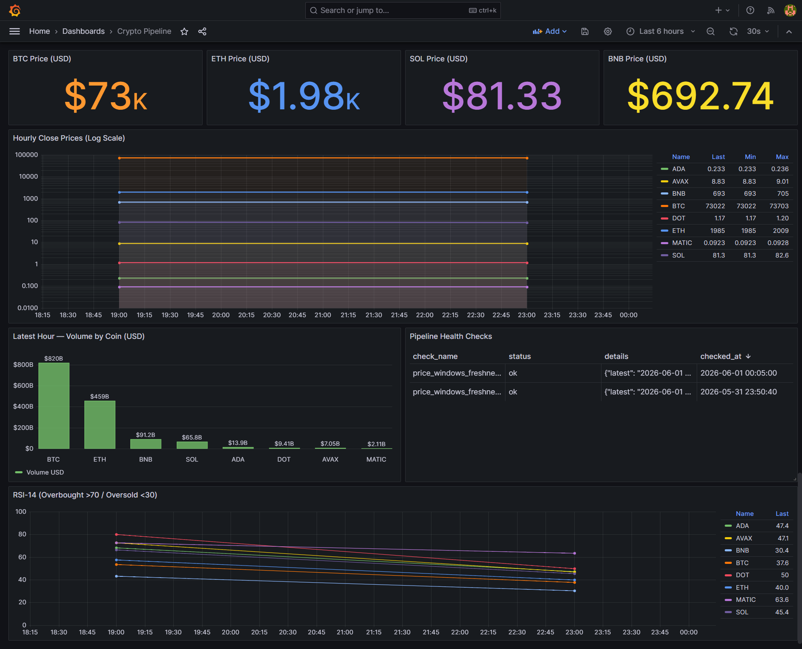
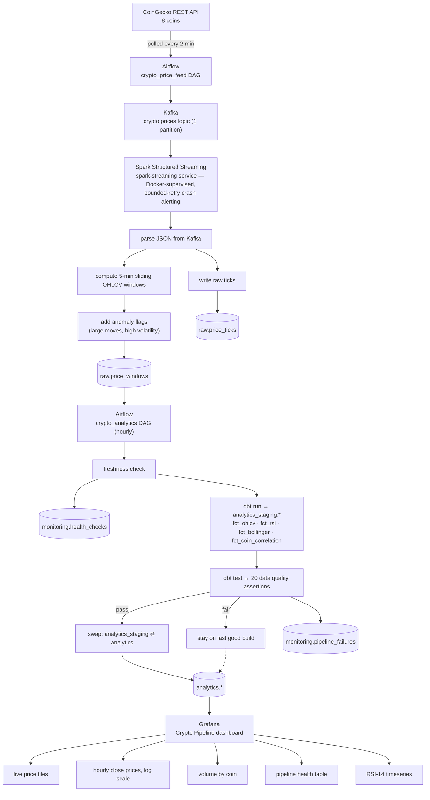
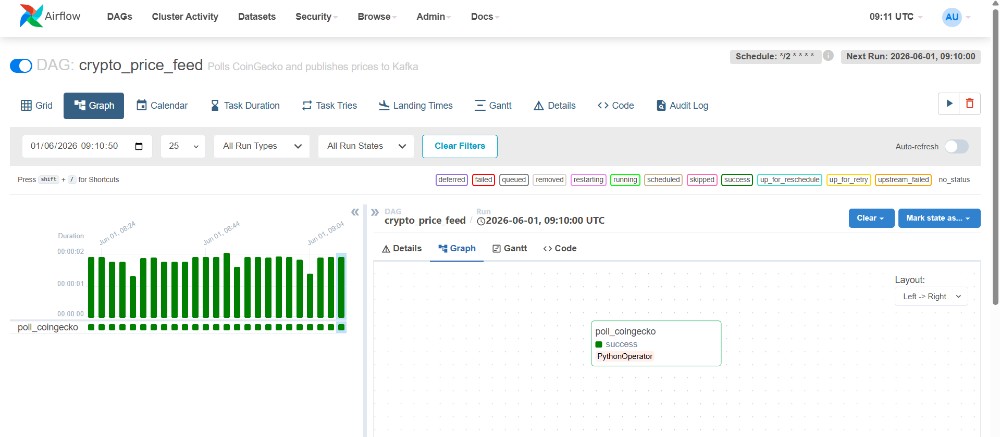
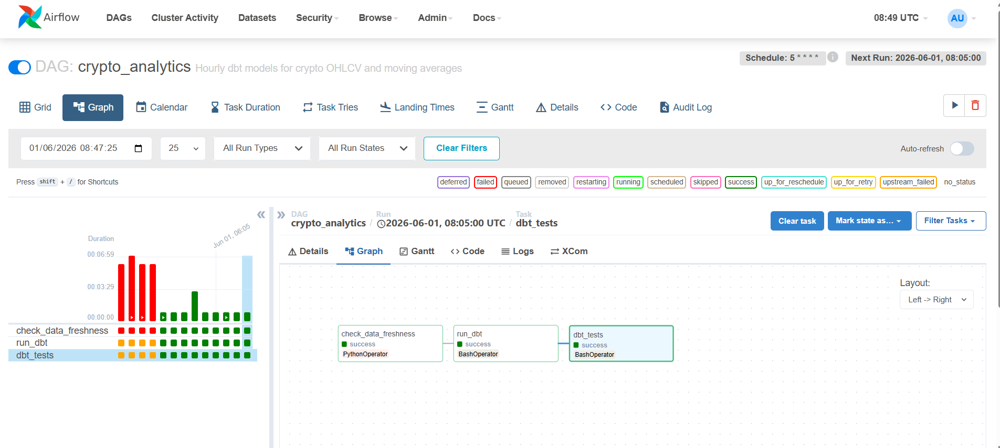

# Real-Time Crypto Streaming Pipeline

A real-time streaming data pipeline that ingests live cryptocurrency prices from CoinGecko, processes them through Apache Kafka and Spark Structured Streaming, builds analytical models with dbt, and visualises everything in Grafana — all running locally in Docker.

---

## Dashboard



Live at `http://localhost:3000` (admin / admin) — auto-refreshes every 30 seconds.

---

## Architecture



A failed `dbt test` never reaches Grafana: production (`analytics`) only ever gets swapped to a build that passed every test — see [Key Concepts](#key-concepts) for how the swap works.

---

## Stack

| Layer | Technology |
|---|---|
| Price feed | CoinGecko REST API |
| Message broker | Apache Kafka (Confluent 7.5, Zookeeper) |
| Stream processing | Apache Spark 3.5 Structured Streaming |
| Storage | PostgreSQL 15 |
| Transformation | dbt-postgres 1.7 |
| Orchestration | Apache Airflow 2.8 (LocalExecutor) |
| Visualisation | Grafana 10.2 |
| Containerisation | Docker Compose |

---

## Airflow DAGs

### `crypto_price_feed`



Runs every 2 minutes. Calls the CoinGecko `/simple/price` endpoint for all 8 coins and publishes JSON events to Kafka.

### `crypto_analytics`



Runs hourly: `check_data_freshness` → `run_dbt` → `dbt_tests` → `swap_analytics_schema`.

1. **`check_data_freshness`** — fails the run (no `dbt` steps execute) if `raw.price_windows` has no rows in the last 10 minutes.
2. **`run_dbt`** — builds all four marts into a scratch `analytics_staging` schema, not production.
3. **`dbt_tests`** — runs all 20 data quality assertions against that staging build.
4. **`swap_analytics_schema`** — only runs if `dbt_tests` passed (Airflow's default trigger rule blocks it otherwise). Atomically renames `analytics_staging` into `analytics`, so production only ever holds a build that passed every test. A failed test leaves `analytics` completely untouched and the bad build sits in `analytics_staging` for inspection.

---

## dbt Models

All models live in `dbt_project/models/` and are materialised as tables. The `crypto_analytics` DAG builds and tests them in a scratch `analytics_staging` schema and only promotes that build into `analytics` (production) after every test passes — see the DAG description above. Querying `analytics.*` directly, as in every example below, always returns the last build that passed all tests.

### `fct_ohlcv`
Hourly OHLCV candles built from `raw.price_windows`. Columns: `symbol`, `hour`, `hour_open`, `hour_high`, `hour_low`, `hour_close`, `hour_volume_usd`, `hour_tick_count`, `had_large_move`, `had_high_volatility`, `ma_24h`, `ma_7d`, `hourly_return_pct`.

### `fct_rsi`
14-period RSI computed via window CTEs on hourly closes. Columns: `rsi_14`, `rsi_signal` (overbought / neutral / oversold), `bullish_momentum`.

### `fct_bollinger`
20-period Bollinger Bands. Columns: `sma_20`, `upper_band`, `lower_band`, `pct_b` (position within bands, 0–1), `bandwidth`. Populates only after 20 hours of data per symbol.

### `fct_coin_correlation`
Rolling 24-hour Pearson correlation between coin pairs (BTC/ETH, BTC/BNB, BTC/SOL, BTC/ADA, BTC/MATIC, BTC/AVAX, BTC/DOT, ETH/SOL) using `corr() OVER (ROWS BETWEEN 23 PRECEDING AND CURRENT ROW)`.

---

## Data Quality Tests

20 dbt tests run every hourly cycle via `dbt test`, against the `analytics_staging` build — before it's ever promoted to production. A failing test blocks promotion entirely (see `swap_analytics_schema` above); it does not roll back or alter an already-promoted `analytics` schema.

**Schema tests** — `not_null` and `accepted_values` on `fct_ohlcv`, `fct_rsi`, `fct_bollinger` columns, plus source-level `not_null` on `raw.price_ticks` and `raw.price_windows`.

**Singular tests** (in `dbt_project/tests/`):
- `assert_prices_positive.sql` — all OHLCV prices must be > 0
- `assert_ohlcv_ordering.sql` — `high ≥ open/close ≥ low` invariant

---

## Monitoring

### `monitoring.pipeline_failures`
Two independent writers:
- Airflow's task-level failure callback (`on_task_failure`) writes every Airflow task failure here automatically.
- `run_streaming.sh` (the Spark job's retry wrapper) writes here too, tagged `dag_id = 'spark_streaming'`, whenever the Spark job crashes — including a count of how many consecutive times it's failed to reach a healthy running state.

```sql
SELECT dag_id, task_id, execution_date, error_message FROM monitoring.pipeline_failures ORDER BY recorded_at DESC LIMIT 20;
```

### `monitoring.health_checks`
Freshness probe writes a row each cycle:
```sql
SELECT check_name, status, details, checked_at FROM monitoring.health_checks ORDER BY checked_at DESC LIMIT 10;
```

---

## Setup

### Prerequisites
- Docker Desktop
- Docker Compose v2

### Start everything

```powershell
cd Real-Time-Crypto-Streaming-Pipeline

# Copy env file (edit credentials if needed)
cp .env.example .env

# Start all services
docker compose up -d

# Wait ~60s for Airflow to initialise, then verify
docker compose ps
```

Airflow UI: `http://localhost:8080` (admin / admin)  
Spark UI:   `http://localhost:8090`  
Grafana:    `http://localhost:3000` (admin / admin)

The Spark streaming job starts automatically as part of `docker compose up -d` (the `spark-streaming` service) — no manual step needed. It's supervised at two levels: `restart: unless-stopped` restarts the whole container if it dies outright, and internally `run_streaming.sh` restarts the job every 15s on a crash, backing off to a 5-minute retry interval after 5 consecutive failures to reach a healthy running state (each one logged to `monitoring.pipeline_failures`). Tail its logs with:

```powershell
docker exec real-time-crypto-streaming-pipeline-spark-streaming-1 tail -f /tmp/streaming.log
```

### Enable the DAGs

In the Airflow UI (`http://localhost:8080`), toggle on:
1. `crypto_price_feed` — starts publishing prices to Kafka
2. `crypto_analytics` — runs dbt hourly

Or via CLI:
```powershell
docker exec real-time-crypto-streaming-pipeline-airflow-scheduler-1 airflow dags unpause crypto_price_feed
docker exec real-time-crypto-streaming-pipeline-airflow-scheduler-1 airflow dags unpause crypto_analytics
```

### Trigger a manual analytics run

```powershell
docker exec real-time-crypto-streaming-pipeline-airflow-scheduler-1 airflow dags trigger crypto_analytics
```

---

## Analytics Queries

```sql
-- Latest price per coin
SELECT DISTINCT ON (symbol)
  symbol, hour, hour_close, ma_24h, hourly_return_pct
FROM analytics.fct_ohlcv
ORDER BY symbol, hour DESC;

-- RSI signals right now
SELECT symbol, rsi_14, rsi_signal
FROM analytics.fct_rsi
WHERE hour = (SELECT MAX(hour) FROM analytics.fct_rsi)
ORDER BY rsi_14 DESC;

-- Bollinger band squeeze (low bandwidth = consolidation)
SELECT symbol, hour, bandwidth, pct_b
FROM analytics.fct_bollinger
ORDER BY bandwidth ASC
LIMIT 10;

-- BTC/ETH rolling correlation
SELECT hour, btc_eth
FROM analytics.fct_coin_correlation
ORDER BY hour DESC
LIMIT 24;

-- Most volatile coins (last 24h)
SELECT symbol,
  ROUND(STDDEV(hourly_return_pct)::numeric, 4) AS volatility,
  ROUND(SUM(hour_volume_usd)::numeric, 0)      AS volume_24h
FROM analytics.fct_ohlcv
WHERE hour > NOW() - INTERVAL '24 hours'
GROUP BY symbol
ORDER BY volatility DESC;
```

---

## Key Concepts

**Spark micro-batches** — Kafka is treated as an unbounded table; every 5 seconds Spark reads new messages since the last committed offset. Checkpoints in `/opt/spark-checkpoints` ensure exactly-once progress tracking — if the job crashes, it resumes from the last offset.

**Sliding windows** — `window("event_time", "5 minutes", "1 minute")` produces overlapping windows (5 active per symbol at any time), giving smoother OHLCV data than non-overlapping tumbling windows.

**Watermark** — `.withWatermark("event_time", "2 minutes")` caps memory: late data up to 2 minutes is accepted; anything older is dropped. Without a watermark, Spark holds every window in memory indefinitely.

**Docker internal DNS** — inside containers, `postgres-crypto:5432` and `kafka:29092` are the correct addresses. The `.env` file uses host-exposed ports (`localhost:5434`, `localhost:9092`) for local tooling. The `x-airflow-common` environment block overrides `.env` with internal addresses so Airflow tasks reach the right hosts.

**dbt singular tests** — SQL files in `dbt_project/tests/` that return rows are failures. Zero rows = the assertion holds.

**Blue-green schema swap** — `dbt run`/`dbt test` never touch `analytics` (production) directly. They build and test in `analytics_staging`, and `swap_analytics_schema` atomically renames the two schemas (`analytics` ⇄ `analytics_staging`) via three `ALTER SCHEMA ... RENAME` statements in a single transaction — a metadata-only operation, effectively instant regardless of table size. If the transaction fails partway, it rolls back completely rather than leaving `analytics` missing or half-swapped. Because Airflow's default trigger rule only runs a task if every upstream task succeeded, a failed `dbt_tests` run means `swap_analytics_schema` never executes at all — Grafana keeps reading the last build that passed every test, and the bad build is left sitting in `analytics_staging` for inspection.

**Layered Spark resilience** — the streaming job is protected at two independent levels. `restart: unless-stopped` on the `spark-streaming` service restarts the *entire container* if it dies outright (e.g. it's killed, the process segfaults) — Docker will not do this after an explicit `docker stop`/`docker kill`, by design, since that's treated as an intentional operator action. Inside the container, `run_streaming.sh`'s own loop restarts just the Spark job on a 15-second cycle for the first 5 consecutive crashes; if the job fails to reach a healthy running state 5 times in a row, it backs off to a 5-minute retry interval instead of hammering a persistent problem forever, and every crash is logged to `monitoring.pipeline_failures`.

---

## Project Status

- [x] CoinGecko REST polling feed (8 coins, polled every 2 minutes via Airflow)
- [x] Kafka topic `crypto.prices` (1 partition)
- [x] Spark Structured Streaming — ticks + 5-min windowed OHLCV
- [x] Anomaly flags — large moves, high volatility (threshold configurable via `PRICE_CHANGE_ALERT_PCT`)
- [x] PostgreSQL dual sink — `raw.price_ticks` + `raw.price_windows`
- [x] dbt mart — `fct_ohlcv` with moving averages, return pct
- [x] dbt analytics — `fct_rsi`, `fct_bollinger`, `fct_coin_correlation`
- [x] 20 dbt data quality tests (schema + singular)
- [x] Airflow hourly DAG with failure callbacks + health checks
- [x] Monitoring schema — `pipeline_failures`, `health_checks`
- [x] Spark streaming as a Docker-supervised service (`spark-streaming`, `restart: unless-stopped`)
- [x] Bounded-retry backoff + crash alerting for the Spark job (`run_streaming.sh` → `monitoring.pipeline_failures`)
- [x] Blue-green schema swap — dbt builds/tests in `analytics_staging`, promotes to `analytics` only if every test passes
- [x] Grafana dashboard — prices, volume, RSI, pipeline health
- [ ] Bollinger Bands panel in Grafana (data populates after 20h)
- [ ] MLOps Phase 2 — price movement prediction + MLflow + FastAPI
